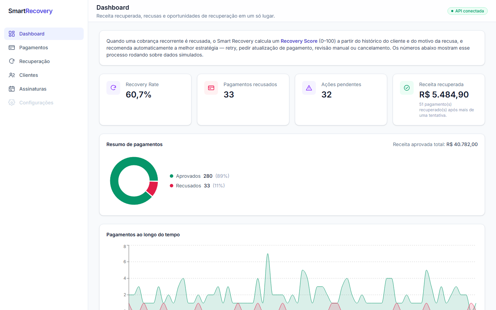
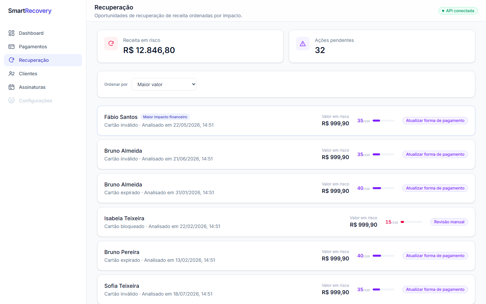
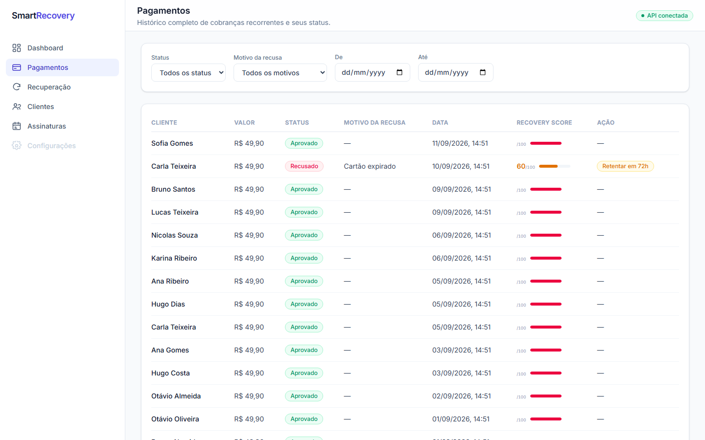
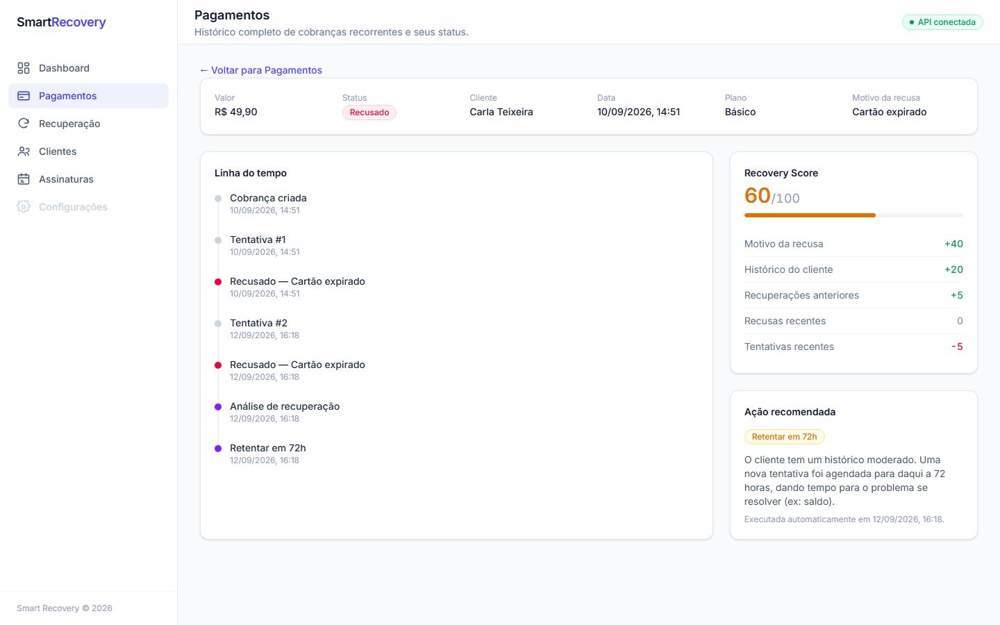
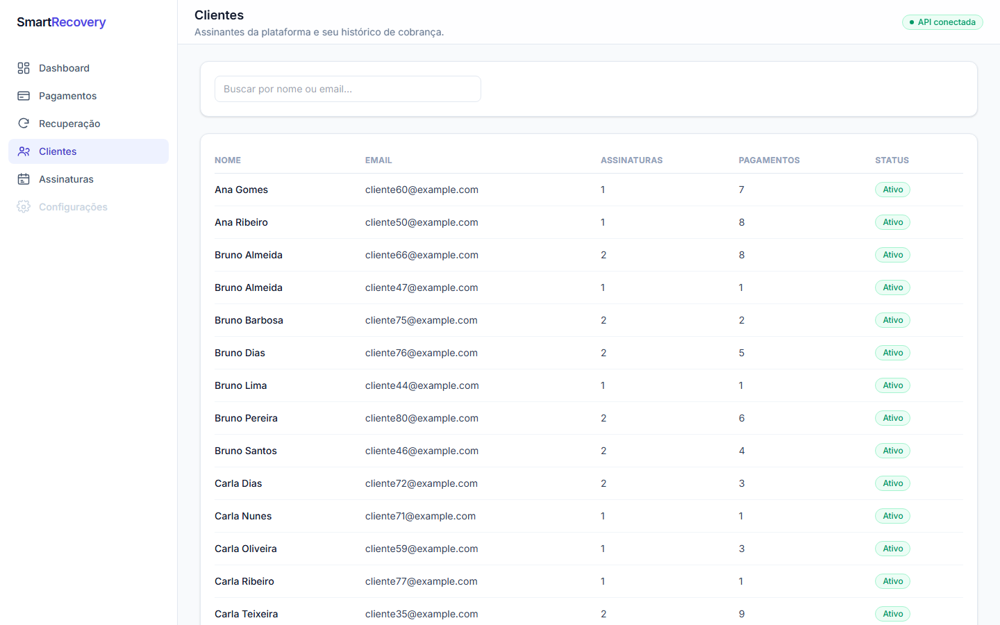
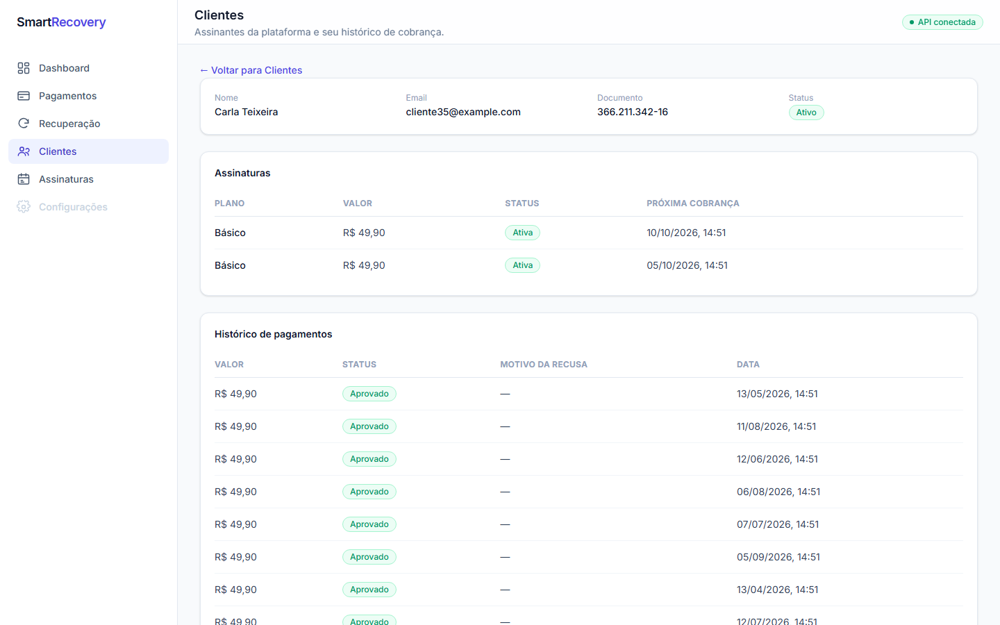
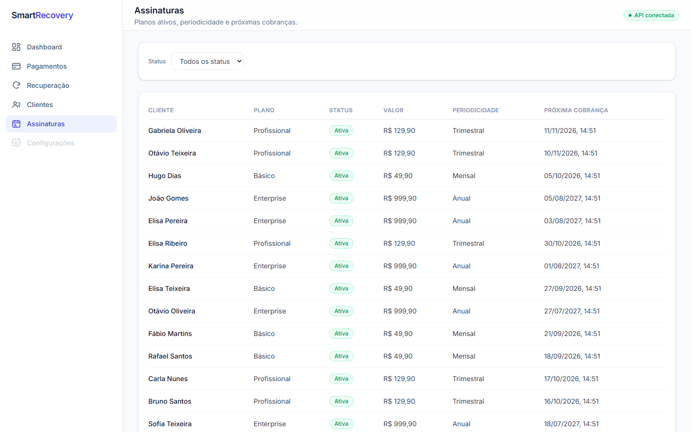

# Smart Recovery

Projeto de portfólio em C# / .NET 8 (Clean Architecture) + React/TypeScript, para praticar um domínio
não trivial: recuperação de pagamentos recorrentes recusados.

O sistema simula o ciclo de cobrança de uma assinatura — quando um pagamento é recusado, calcula um
**Recovery Score** explicável (0–100) a partir do histórico do cliente e do motivo da recusa, e
recomenda uma ação (retry, pedir atualização de forma de pagamento, revisão manual ou cancelamento da
assinatura).



Dados simulados, sem gateway de pagamento real e sem autenticação — ver [Limitações conhecidas](#limitações-conhecidas).

## Arquitetura

Clean Architecture em 4 camadas, com o Domain isolado de qualquer dependência de infraestrutura:

```
SmartRecovery.Domain          regras de negócio puras (RecoveryScoreCalculator, RecoveryDecisionEngine,
                               BillingCycleCalculator, RecoveryActionScheduler) + entidades + interfaces
        ↑
SmartRecovery.Application     casos de uso (Services), DTOs, orquestra Domain + Infrastructure
        ↑
SmartRecovery.Infrastructure  EF Core + PostgreSQL, repositórios, seed, background workers
        ↑
SmartRecovery.API             Controllers, Swagger, tratamento de erro global, logging
```

O React consome a API somente por HTTP — nenhuma regra de negócio (cálculo de score, decisão de ação) é
duplicada no frontend. O backend é a única fonte da verdade.

## Tecnologias

**Backend:** .NET 8, ASP.NET Core Web API, Entity Framework Core 8 + Npgsql, PostgreSQL, Serilog, xUnit + Moq, Respawn (testes de integração).

**Frontend:** React 19, TypeScript, Vite, Tailwind CSS v4, React Router, Axios, Recharts.

## Funcionalidades

- **Dashboard**: KPIs (recovery rate, receita recuperada, ações pendentes), distribuição de pagamentos, tendência diária de aprovados/recusados, motivos de recusa mais comuns.
- **Pagamentos**: listagem paginada com filtros (status, motivo, cliente, período), detalhe com linha do tempo completa e breakdown do Recovery Score.
- **Recuperação**: fila de oportunidades pendentes ordenável por impacto financeiro, score ou ação, com resumo de receita em risco.
- **Clientes**: listagem paginada com busca, detalhe com histórico de pagamentos e recuperações.
- **Assinaturas**: listagem paginada filtrável por status, com próxima data de cobrança.
- **Webhooks**: endpoint idempotente para receber resultado de cobranças de um provedor externo (simulado).

## Fluxo de pagamento

```
Assinatura vence
      ↓
PaymentRetryWorker cria Payment (Pending)
      ↓
PaymentGatewaySimulator processa a cobrança (75% aprovação / 25% recusa)
      ↓
   Aprovado ──────────────────────────────► fim do ciclo
      │
   Recusado
      ↓
RecoveryService.AnalyzeAsync (RecoveryScoreCalculator + RecoveryDecisionEngine)
      ↓
Ação recomendada: RetryIn2/24/72Hours | RequestPaymentMethodUpdate | ManualReview | CancelSubscription
      ↓
Retry agendado?  → PaymentRetryWorker retenta automaticamente na data marcada
```

O mesmo pipeline roda em produção, no seed de dados e nos testes de integração — não há um "modo demo" com lógica separada.

## Recovery Score

`RecoveryScoreCalculator.CalculateBreakdown` (`SmartRecovery.Domain/BusinessRules/`) soma cinco fatores nomeados, cada um com o sinal já aplicado:

| Fator | O que mede |
|---|---|
| Base score | Perfil de recuperabilidade do motivo da recusa (ex.: erro temporário recupera bem; cartão bloqueado, mal) |
| Ajuste de histórico | Taxa de sucesso histórica do cliente |
| Bônus de track record | Quantas vezes o cliente já foi recuperado antes |
| Ajuste de recusas recentes | Recusas nos últimos 30 dias |
| Ajuste de tentativas recentes | Volume de tentativas recentes (fadiga de retry) |

`RecoveryDecisionEngine.Decide(score, motivo)` traduz o score final em uma ação. A API expõe o breakdown completo (`GET /api/recovery/payments/{id}`) — o frontend só renderiza os números que o backend calculou.

## API

Principais endpoints (Swagger disponível em `/` ao rodar em Development):

| Método | Rota | Descrição |
|---|---|---|
| GET | `/api/payments` | Lista paginada, filtrável por status/motivo/cliente/período |
| GET | `/api/payments/{id}` | Detalhe + `/attempts` para o histórico de tentativas |
| POST | `/api/payments/subscriptions/{id}` | Cria cobrança pendente para uma assinatura |
| POST | `/api/payments/{id}/process` | Processa via gateway; aciona recuperação se recusado |
| GET | `/api/customers` | Lista paginada com busca por nome/email |
| GET | `/api/subscriptions` | Lista paginada filtrável por status |
| GET | `/api/recovery/payments/{id}` | Análise de recuperação de um pagamento |
| GET | `/api/recovery/pending` | Ações de recuperação ainda não executadas |
| GET | `/api/dashboard/summary` \| `/decline-reasons` \| `/trends` | Agregados do Dashboard |
| POST | `/api/webhooks/payments` | Recebe resultado de cobrança externa (idempotente) |

Erros seguem `ProblemDetails` (RFC 7807) em toda a API.

## Banco de dados

PostgreSQL, sem dados fabricados à mão: o seed (`SmartRecoveryDataSeeder`) simula ~9 meses de cobrança
reaproveitando o mesmo pipeline de produção (`BillingCycleCalculator`, `RecoveryScoreCalculator`,
`RecoveryDecisionEngine`), com uma seed fixa (`Random(42)`) para o resultado ser reprodutível.

Volume atual: 80 clientes, 104 assinaturas ativas, 313 pagamentos, 33 recusados, 51 recuperados após
mais de uma tentativa (recovery rate 60,7%), todos os 6 `DeclineReason` e as 6 `RecoveryAction`
representados no histórico de tentativas/análises.

## Testes

- **26 testes unitários** (`tests/SmartRecovery.Tests/Domain`, `/Application`) cobrindo as regras de negócio isoladamente (Moq nos repositórios).
- **9 testes de integração** (`tests/SmartRecovery.Tests/Integration`) rodando HTTP → Controller → Application → EF Core → PostgreSQL de verdade, contra um banco separado (`smart_recovery_test`, criado e migrado automaticamente): criar pagamento, processar pagamento (aprovado/recusado, com verificação de que a análise de recuperação é gerada), consultar recuperação, webhook válido, duplicado (idempotência) e inválido (validação).

```bash
dotnet test
```

## Como executar

Requer PostgreSQL rodando localmente (este projeto foi desenvolvido sem Docker).

```bash
# 1. Criar o banco e o usuário (uma vez)
psql -U postgres -c "CREATE USER admin WITH PASSWORD 'admin123' SUPERUSER;"
psql -U postgres -c "CREATE DATABASE smart_recovery OWNER admin;"

# 2. Backend — aplica migrations e popula o seed automaticamente no primeiro start
dotnet run --project src/SmartRecovery.API

# 3. Frontend
cd frontend
npm install
npm run dev
```

API em `http://localhost:5000` (Swagger em `/`), frontend em `http://localhost:5173`.

## Screenshots

| Dashboard | Recuperação |
|---|---|
|  |  |

| Pagamentos | Detalhe do pagamento |
|---|---|
|  |  |

| Clientes | Detalhe do cliente |
|---|---|
|  |  |

| Assinaturas |
|---|
|  |

## Limitações conhecidas

- **Autenticação e autorização não estão implementadas** — decisão consciente, já que este é um projeto de portfólio/demonstração. Num próximo passo, entraria como Login → JWT → Authorization → API.
- **Gateway de pagamento simulado**: `IPaymentGatewaySimulator` já isola a interface da implementação (`PaymentGatewaySimulator`), pronta para receber uma implementação real (ex.: modo sandbox de um provedor) sem alterar o resto do sistema.
- **Sem deploy público** neste momento.
